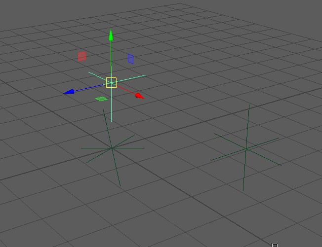

# aimNode
----
# Information:
  Basic Aim Node C++ Plugin using CMake

# Purpose:
  To save the configuration and build settings of CMake files.

## The Plugin:
  Basically an aim vector pointer. Using normalized Vectors.

### the math:
    _MVector_ z_vec = forwardData.asVector();
    z_vec *= -1;
    upVector.normalize();
    z_vec.normalize();

    _MVector_ x_vec = z_vec ^ upVector;
    x_vec.normalize();
    _MVector_ y_vec = x_vec ^ z_vec;
    y_vec.normalize();

### building the matrix
    _double_ MyMatrix[4][4] = { {x_vec.x, x_vec.y, x_vec.z, 0},
                                {y_vec.x, y_vec.y, y_vec.z, 0},
                                {z_vec.x, z_vec.y, z_vec.z, 0},
                                {0.0, 0.0, 0.0, 1.0}
                              };

## Demo:

## Resources used
Autodesk Maya C++ Reference Documentation:
http://help.autodesk.com/view/MAYAUL/2019/ENU/?guid=Maya_SDK_MERGED_cpp_ref_build_rotation_node_2build_rotation_node_8cpp_example_html
